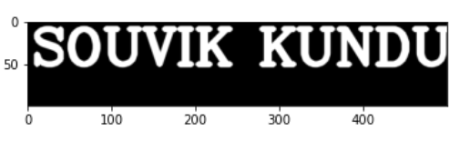
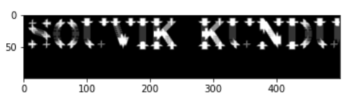
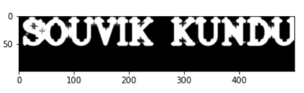

# Opening-and-Closing

## Aim:

To implement Opening and Closing using Python and OpenCV.

## Software Required:

1. Anaconda - Python 3.7.
2. OpenCV.

## Algorithm:

### Step 1:

Import the necessary packages.

### Step 2:

Create the Text using cv2.putText.

### Step 3:

Create the structuring element.

### Step 4:

Use Opening operation.

### Step 5:

Use Closing Operation.
 
## Program:
~~~
Developed by : Souvik Kundu
Register Number : 212221230105
~~~
## Import the necessary packages:
~~~
import numpy as np
import cv2
import matplotlib.pyplot as plt
~~~
## Create the Text using cv2.putText:
~~~
img=np.zeros((100,500),dtype='uint8')
font=cv2.FONT_HERSHEY_COMPLEX
img1=cv2.putText(img,'Souvik Kundu',(5,50),font,2,(255),5,cv2.LINE_AA)
plt.imshow(img1)
~~~
## Create the structuring element:
~~~
Kernel=cv2.getStructuringElement(cv2.MORPH_CROSS,(11,11))
~~~
## Use Opening operation:
~~~
image1=cv2.morphologyEx(img,cv2.MORPH_OPEN,Kernel)
plt.imshow(image1)
~~~
## Use Closing Operation:
~~~
image1=cv2.morphologyEx(img,cv2.MORPH_CLOSE,Kernel)
plt.imshow(image1)
~~~

## Output:

### Display the input Image:

### Display the result of Opening:

### Display the result of Closing:

## Result:
Thus, the Opening and Closing operation is used in the image using python and OpenCV.